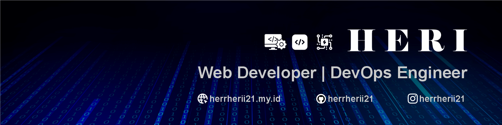

  

  <strong>Web Developer & DevOps Engineer</strong>
   
  System Analyst · Full Stack Development · DevOps Engineering

  <a href="https://linkedin.com/in/herrherii21">LinkedIn</a>
  &nbsp;•&nbsp;
  <a href="https://herrherii21.my.id">Portfolio</a>
  &nbsp;•&nbsp;
  <a href="mailto:herii2k01@gmail.com">Email</a>

---

## 👋 About Me

Fresh Graduate with a **Bachelor’s degree in Informatics Engineering** and professional experience as a **System Analyst**. Experienced in **business analysis, requirements analysis, business process validation, software development, and system testing**, with a strong understanding of the software development lifecycle.

Interested in **Full Stack Development** and **DevOps Engineering**, I focus on building **reliable, scalable, and user-friendly applications** while understanding the complete journey from **analysis and development to testing, infrastructure, and deployment**.

---

# 💻 Tech Stack

## 🌐 Software Development

### Frontend

  

### Backend

  

### Database

  

---

## ⚙️ DevOps & Infrastructure

  

  <strong>Server Management</strong>
   
  Proxmox &nbsp;•&nbsp; Webmin &nbsp;•&nbsp; aaPanel &nbsp;•&nbsp; Portainer

---

## 🛠️ Version Control & Tools

  

---

## 📚 Currently Learning

  

---

## 🤖 AI Tools

  <strong>ChatGPT</strong>
  &nbsp;•&nbsp;
  <strong>Claude</strong>
  &nbsp;•&nbsp;
  <strong>Codex</strong>
  &nbsp;•&nbsp;
  <strong>Cursor</strong>
  &nbsp;•&nbsp;
  <strong>Antigravity</strong>
  &nbsp;•&nbsp;
  <strong>GitHub Copilot</strong>
  &nbsp;•&nbsp;
  <strong>n8n</strong>
  &nbsp;•&nbsp;
  <strong>OpenClaw</strong>

---

## 🎯 Areas of Interest

  📐 <strong>System Analysis</strong>
  &nbsp;•&nbsp;
  💻 <strong>Full Stack Development</strong>
  &nbsp;•&nbsp;
  ⚙️ <strong>DevOps Engineering</strong>

---

  <i>Building software, understanding systems, and continuously learning.</i>

