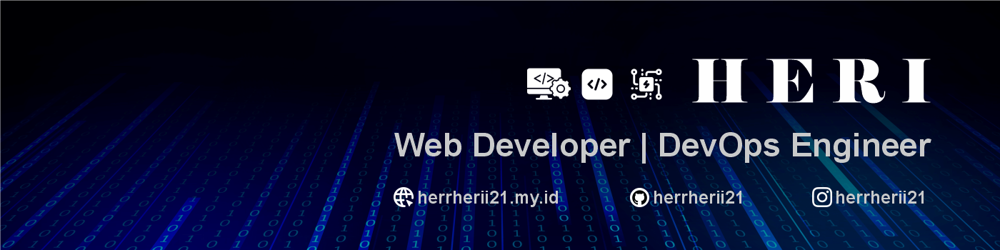

  

Fresh Graduate with a **Bachelor’s degree in Informatics Engineering** and professional experience as a **System Analyst**. Experienced in **business analysis, requirements analysis, business process validation, software development, and system testing**, with a strong understanding of the software development lifecycle.

Interested in **Full Stack Development** and **DevOps Engineering**, I am focused on building **reliable, scalable, and user-friendly applications** through end-to-end software development, combining software development knowledge with infrastructure and deployment understanding.

---

# 💻 Tech Stack

## 🌐 Software Development

### Frontend

  

### Backend

  

### Database

  

### Mobile

  

---

## ⚙️ DevOps & Infrastructure

### Infrastructure & Operating Systems

  

### Cloud & Infrastructure as Code

  

### DevOps, CI/CD & Monitoring

  

### Security & Cybersecurity

  

---

## 🛠️ Tools & Version Control

  

---

## 📚 Currently Learning

  

---

## 🤖 AI Tools

  <strong>ChatGPT</strong>
  &nbsp;&nbsp;•&nbsp;&nbsp;
  <strong>Claude</strong>
  &nbsp;&nbsp;•&nbsp;&nbsp;
  <strong>Codex</strong>
  &nbsp;&nbsp;•&nbsp;&nbsp;
  <strong>Cursor</strong>
  &nbsp;&nbsp;•&nbsp;&nbsp;
  <strong>Antigravity</strong>
  &nbsp;&nbsp;•&nbsp;&nbsp;
  <strong>GitHub Copilot</strong>
  &nbsp;&nbsp;•&nbsp;&nbsp;
  <strong>n8n</strong>
  &nbsp;&nbsp;•&nbsp;&nbsp;
  <strong>OpenClaw</strong>

---

## 🎯 Areas of Interest

  📐 <strong>System Analysis</strong>
  &nbsp;&nbsp;•&nbsp;&nbsp;
  💻 <strong>Full Stack Development</strong>
  &nbsp;&nbsp;•&nbsp;&nbsp;
  ⚙️ <strong>DevOps Engineering</strong>

---

  <i>Building software, understanding systems, and continuously learning.</i>

